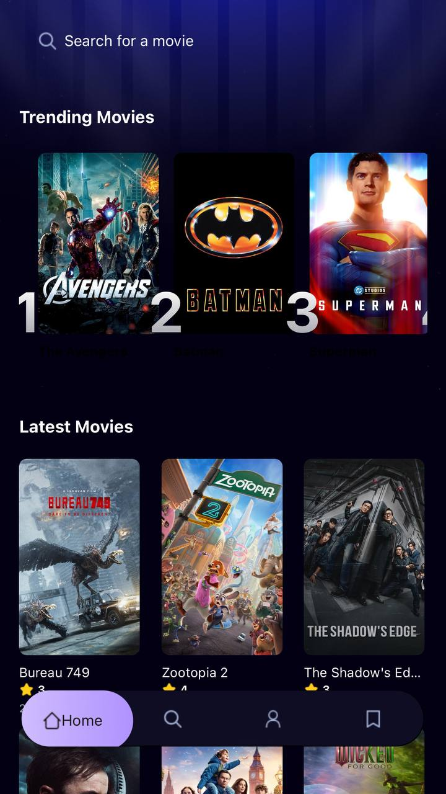
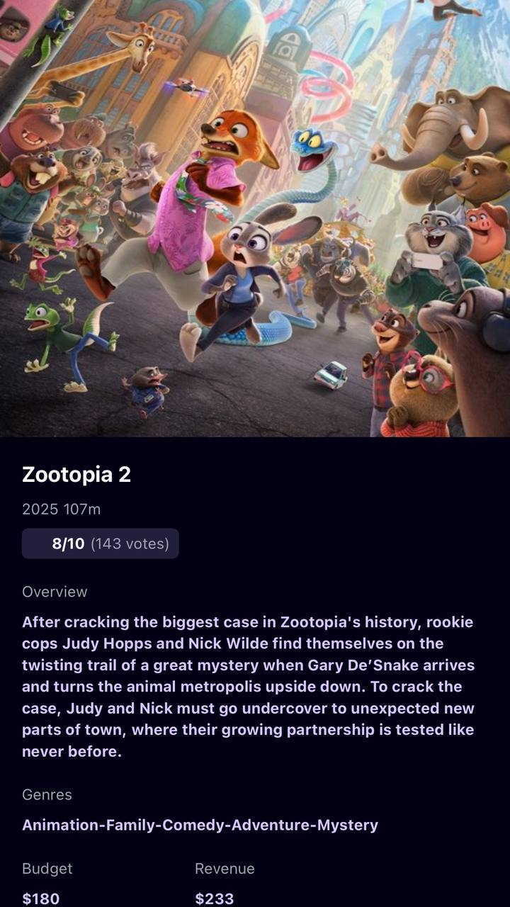
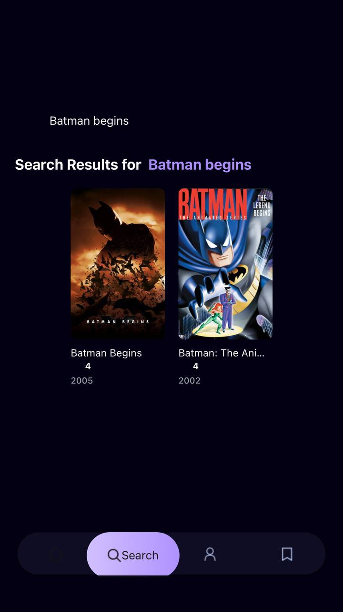

# 🎬 Mobile Movie App
A cross-platform **React Native + Expo** application for browsing movies, searching titles, viewing trending results, and tracking user search analytics using **Appwrite backend services**.  
Supports **Android**, **iOS (with Dev Client)**, and **Web**.



## ✨ Features
- 🔎 Movie Search with debounce  
- 🎞️ Trending Movies  
- 🏆 Search Analytics Tracking  
- 🌁 NativeWind UI  
- 🚀 Android, iOS, Web  
- 🔐 Optional Google Auth  
- ⚡ Fast UI  
- 🗂 TMDB API  



## 📱 Tech Stack
- Expo SDK 54  
- React Native 0.81  
- React 19.1  
- NativeWind  
- Appwrite  
- TMDB API  
- Expo Router  
- TypeScript  



## 🛠️ Installation
```sh
git clone https://github.com/yourusername/mobile_movie_app.git
cd mobile_movie_app
npm install --legacy-peer-deps
```

## 🔧 Environment Variables
Create `.env`:
```
EXPO_PUBLIC_MOVIE_API_KEY=YOUR_TMDB_API_KEY
EXPO_PUBLIC_APPWRITE_ENDPOINT="https://cloud.appwrite.io/v1"
EXPO_PUBLIC_APPWRITE_PROJECT_ID=YOUR_PROJECT_ID
EXPO_PUBLIC_APPWRITE_DATABASE_ID=YOUR_DATABASE_ID
EXPO_PUBLIC_APPWRITE_COLLECTION_ID=YOUR_COLLECTION_ID
```

## ▶️ Run App
```sh
npx expo start -c
```

## 📱 Platform Notes
- Android: works fully  
- iOS: needs Dev Client for OAuth  
- Web: works  

## ✨ Appwrite
Tracks search counts + trending movies.

